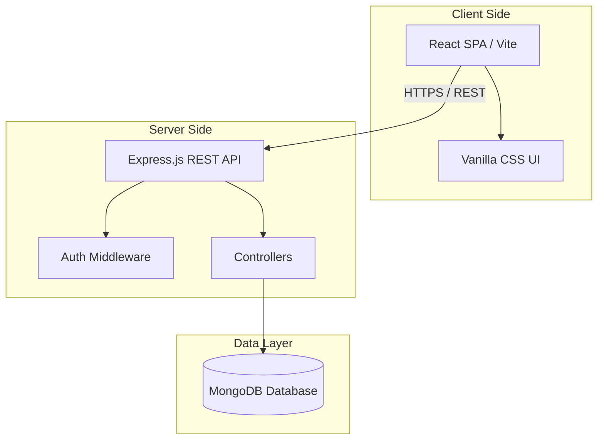

# FocusDesk System Design

Welcome to **FocusDesk**, a modern platform connecting students looking for quiet study spaces with library owners managing seat inventory, bookings, and payments.

This document outlines the requirements, system architecture, database schema, and Day 1 feature breakdown.

---

## 📋 FocusDesk MVP Decisions

We adhere strictly to the following architectural and business constraints for the Minimum Viable Product (MVP):

1. **Offline Payment Only**: No digital gateway integrations (Stripe, Razorpay) are implemented. All booking fees are estimated online and settled offline (via cash or transfer) upon arrival.
2. **2-Hour Reservation Limit**: To ensure high seat rotation, all reservation slots are capped at a maximum of 2 hours.
3. **Single Active Booking Restriction**: A student user is restricted to a maximum of one active booking (status: `pending` or `confirmed` with future `endTime`) at any given time.
4. **Manual Approval**: Library owners review booking queues and manually confirm or reject requests.
5. **Real-time Notifications**: Notify students immediately when owners confirm or cancel bookings.
6. **Seat Inventory Formula**: Available seat counters are calculated dynamically:
   $$\text{availableSeats} = \text{totalSeats} - \text{occupiedSeats}$$
7. **One Library per Owner**: Each owner profile manages exactly one physical library branch.
8. **First-Come, First-Served**: Bookings are processed sequentially. Overlapping timeslots for the same seat ID are blocked at the database check level.

---

## 1. Requirements & User Stories

### For Students
- **Discovery**: Search libraries by name or location, and filter by available facilities.
- **Seat Availability**: View real-time seat availability maps/grids for a specific library.
- **Comparison**: Compare hourly fees and amenities.
- **Bookings**: Select a specific seat, choose date and time slots, and submit a booking request.
- **Payments**: Verify estimation and register offline payment logs.
- **Notifications**: Get real-time alerts for booking confirmations.

### For Library Owners
- **Library Management**: Manage a single library branch layout, price plans, and amenities.
- **Seat Grid Management**: Design the seat layout and toggle statuses between available, occupied, and maintenance.
- **Booking Management**: Review pending bookings and manually approve/reject them.
- **Notifications**: Receive alerts when students request bookings.

---

## 2. High-Level Architecture

- **Frontend**: **React** using **Vite** for fast, optimized builds. Styling is crafted using **Vanilla CSS**.
- **Backend**: **Node.js** with **Express.js** providing a structured, secure RESTful API.
- **Database**: **MongoDB** using **Mongoose ODM**.

---

## 3. Database Schema (NoSQL)

Detailed mongoose models can be found inside [backend/models/](file:///C:/Users/dell/.gemini/antigravity-ide/scratch/studyseat/backend/models/).
- **Users**: Credentials, verification, contact details, and user roles (`student`, `owner`).
- **Libraries**: Operational schedules, amenities list, geospatial points (`location`), and embedded array of `seats`.
- **Bookings**: Student ID, library ID, target seat, timeslots, and reservation statuses.
- **Payments**: Associated booking link, invoice amount, and offline settlement logs.
- **Notifications**: System warnings and alerts targeted to user IDs.
